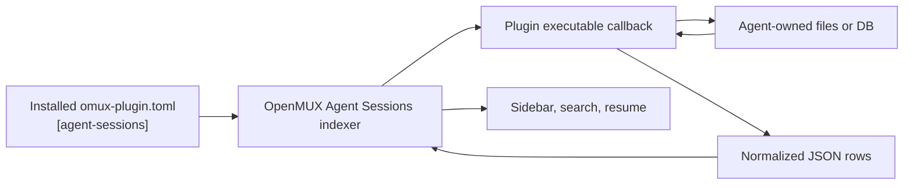

# OpenMUX Plugins Registry

This repository is the official OpenMUX plugin registry. It hosts installable plugin packages that can be discovered and copied into a user's local OpenMUX configuration with the `omux` CLI.

OpenMUX is a terminal-first, hackable workspace for developers. Plugins are external executables with explicit manifests. They use public OpenMUX surfaces such as the CLI, hooks, extension panes, menu contributions, and Agent Sessions adapter callbacks.

Main project:

https://github.com/finger-gun/omux

## How the registry works

The registry root contains `catalog.toml`. Each package entry points to an `omux-plugin.toml` manifest in `plugins/<package-id>/`.

```text
catalog.toml
plugins/
  hello-pane/
    omux-plugin.toml
    plugin
  opencode/
    omux-plugin.toml
    plugin
    README.md
```

Users discover and install packages with:

```sh
omux plugins discover
omux plugins install <plugin-id>
omux plugins update <plugin-id>
omux plugins uninstall <plugin-id>
```

Installing a package copies its declared files into `~/.omux/plugins/<command>/`. OpenMUX never runs code from the registry during discovery or install. Installed plugins run later as local executable commands or as manifest-declared callbacks.

## Package format

`catalog.toml` lists available packages:

```toml
schema = 1

[packages.hello-pane]
kind = "plugin"
name = "Hello Pane"
description = "Creates a sample extension pane."
version = "0.1.0"
path = "plugins/hello-pane/omux-plugin.toml"
tags = ["demo", "extension-pane"]
```

Each package manifest declares the command, entrypoint, and files to install:

```toml
schema = 1
id = "hello-pane"
name = "Hello Pane"
description = "Creates a sample extension pane."
version = "0.1.0"
license = "Apache-2.0"
kind = "plugin"

[plugin]
command = "hello-pane"
entrypoint = "plugin"

[files.entrypoint]
source = "plugin"
target = "plugin"
executable = true

[files.manifest]
source = "omux-plugin.toml"
target = "omux-plugin.toml"
executable = false
```

The manifest file should be installed for any plugin that contributes capabilities through `omux-plugin.toml`, such as menus, hooks, or Agent Sessions adapters. Without the installed manifest, OpenMUX can still run the command, but it cannot discover manifest-declared capabilities.

Plugin entrypoints can be Bash, TypeScript, native binaries, or any other executable format with an appropriate shebang. Plugins receive their CLI arguments unchanged and can call the public `omux` CLI to interact with OpenMUX.

## Current plugins

| Package | Command | What it does |
| --- | --- | --- |
| `hello-pane` | `omux hello-pane` | Creates a sample extension pane with local HTML content. |
| `macos-notify` | `omux macos-notify` | Sends a native macOS notification using the built-in notification system. |
| `settings-ui` | `omux settings-ui` | Opens an extension-pane form for supported `config.toml` settings and saves through `omux config apply`. |
| `agentsessions.opencode` | `omux agentsessions.opencode` | Adds OpenCode sessions to the Agent Sessions sidebar by reading OpenCode's local SQLite database. |
| `agentsessions.kilocode` | `omux agentsessions.kilocode` | Adds KiloCode sessions to the Agent Sessions sidebar by reading KiloCode's local SQLite database. |
| `agentsessions.antigravity` | `omux agentsessions.antigravity` | Adds Antigravity (`agy`) trajectories to the Agent Sessions sidebar from the local VS Code state store. |
| `agenttools.webpage` | `omux agenttools.webpage` | Adds a webpage-reading agent tool that fetches a URL, extracts readable text, and returns a compact summary through `omux agent`. |

OpenMUX also ships bundled plugins in the main app. They are not duplicated here when they are app-owned or when their command names are reserved by built-in `omux` commands.

## Agent tool plugins

Agent tool plugins let the community add focused local tools to `omux agent` without changing OpenMUX core. They are normal manifest plugins with one or more `[agent-tools.*]` entries in `omux-plugin.toml`.

The `agenttools.webpage` package is the first example. It contributes `agenttools.webpage.read-url`, which accepts a URL plus optional focus instructions, fetches the page locally, and returns a compact plain-text result.

## Agent Sessions plugins

Agent Sessions plugins let the community add support for new coding-agent harnesses without changing OpenMUX core. They are normal plugin packages with an `[agent-sessions]` table in `omux-plugin.toml`.



The plugin's job is to normalize data. OpenMUX owns the index, sidebar, search, local delete/hide state, and resume flow.

A minimal Agent Sessions manifest capability looks like this:

```toml
[plugin]
command = "agentsessions.my-agent"
entrypoint = "plugin"

[agent-sessions]
name = "my-agent"
callback = "__omux_agent_sessions"
arguments = ["discover"]
source_kind = "my_agent_store"
resume_command = "my-agent resume {session_id}"

[files.entrypoint]
source = "plugin"
target = "plugin"
executable = true

[files.manifest]
source = "omux-plugin.toml"
target = "omux-plugin.toml"
executable = false
```

During reindex, OpenMUX launches the installed entrypoint with the callback and arguments:

```sh
~/.omux/plugins/agentsessions.my-agent/plugin __omux_agent_sessions discover
```

The callback prints a JSON array to stdout:

```json
[
  {
    "id": "abc123",
    "title": "Fix terminal resize",
    "cwd": "/Users/example/project",
    "updated_at": "2026-05-21T18:00:00Z",
    "source_path": "/Users/example/.my-agent/sessions.db",
    "model": "example-model"
  }
]
```

Required row field:

| Field | Meaning |
| --- | --- |
| `id` | Stable upstream session ID. This is substituted into `{session_id}` for resume commands. |

Optional row fields:

| Field | Meaning |
| --- | --- |
| `title` | Display title. |
| `cwd` | Working directory or project root. |
| `updated_at` | Last update time as ISO-8601 or a numeric Unix timestamp. |
| `source_path` | Source file or database path. |
| `model` | Model display name. |
| `git_branch` | Git branch display name. |
| `agent` | Per-row agent name, useful when one plugin indexes multiple agents. |

Diagnostics should go to stderr. If the upstream agent is not installed or has no sessions, print `[]` and exit successfully.

The `[agent-sessions] name` value is the indexed and displayed Agent Sessions agent name. There is no OpenMUX-owned list of external agent names. If a community plugin intentionally replaces support for a bundled agent, users can disable the built-in adapter while leaving the plugin adapter enabled:

```toml
[agent-sessions.agents.codex]
enabled = false

[agent-sessions.external.codex-plus]
enabled = true
```

See [`plugins/agentsessions.opencode`](./plugins/agentsessions.opencode) for a complete SQLite-backed example.

## OpenCode example

The `opencode` package demonstrates the intended Agent Sessions plugin pattern:

- It declares a namespaced plugin command and an Agent Sessions `name` in `omux-plugin.toml`.
- It reads OpenCode's local database at `~/.local/share/opencode/opencode.db`.
- It uses `sqlite3 -json` to emit rows already shaped for OpenMUX.
- It registers the correct resume command: `opencode -s {session_id}`.
- It installs its manifest so OpenMUX can discover the adapter after installation.

## Menu contributions

`settings-ui` declares a native menu contribution:

```toml
[menu.configuration.open-settings]
location = "Configuration"
title = "Open Settings"
command = "settings-ui"
arguments = []
```

When installed in a version of OpenMUX that supports plugin menu contributions, this appears under **Configuration -> Open Settings**. The plugin uses extension-pane actions for Save and never writes `config.toml` directly.

## Trust model

Plugins are executable local code. Review package contents before installing packages from any registry you do not control. OpenMUX prints the package source, version, and target paths before installation.
