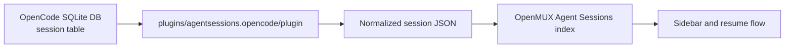

# OpenCode Agent Sessions Plugin

This package is an Agent Sessions plugin for OpenMUX. It adds OpenCode sessions to the OpenMUX Agent Sessions sidebar without adding OpenCode-specific adapter code to OpenMUX core.

## What it does

OpenCode stores sessions in a local SQLite database:

```text
~/.local/share/opencode/opencode.db
```

The plugin reads the `session` table and emits normalized JSON rows that OpenMUX can index.




## Manifest

The relevant capability is declared in `omux-plugin.toml`:

```toml
[plugin]
command = "agent-sessions.opencode"
entrypoint = "plugin"

[agent-sessions]
name = "my-agent"
callback = "__omux_agent_sessions"
arguments = ["discover"]
source_kind = "opencode_sqlite"
resume_command = "opencode -s {session_id}"
```

The plugin command is namespaced as `agent-sessions.opencode`, while `[agent-sessions] name = "opencode"` is the indexed and displayed Agent Sessions agent name. OpenMUX does not need a hardcoded list of third-party plugin agents.

## Callback

OpenMUX calls the plugin during Agent Sessions reindex:

```sh
~/.omux/plugins/agentsessions.opencode/plugin __omux_agent_sessions discover
```

The callback prints JSON like:

```json
[
  {
    "id": "ses_1b34e94fbffeng0AtTNYBWG0hL",
    "title": "Greeting",
    "cwd": "/Users/example/project",
    "updated_at": "1779403303910",
    "source_path": "/Users/example/.local/share/opencode/opencode.db",
    "model": "devstral-small-2:24b"
  }
]
```

Only `id` is required. The other fields improve display, filtering, and diagnostics.

## Install

Install from the default OpenMUX plugin registry:

```sh
omux plugins install agentsessions.opencode
```

Then reindex Agent Sessions from OpenMUX or the CLI:

```sh
omux agent-sessions reindex
```

## Configuration

External Agent Sessions adapters are enabled by default. To disable only this plugin adapter:

```toml
[agent-sessions.external.opencode]
enabled = false
```

## Development

Run against your local OpenCode database:

```sh
plugins/agentsessions.opencode/plugin __omux_agent_sessions discover
```

Run against a fixture database:

```sh
OPENCODE_DB=/tmp/opencode.db plugins/agentsessions.opencode/plugin __omux_agent_sessions discover
```

Validate JSON output:

```sh
plugins/agentsessions.opencode/plugin __omux_agent_sessions discover | python3 -m json.tool
```


